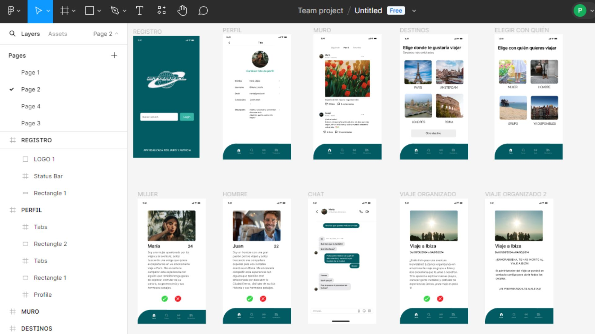

# Proyecto API REST

## Descripción

Este proyecto consiste en desarrollar una API REST utilizando MongoDB con Mongoose y Express. La API permitirá la gestión de usuarios y posts con las siguientes funcionalidades clave:

- Registro de usuarios utilizando Bcrypt.
- Autenticación de usuarios con JWT.
- CRUD para posts.
- Dar y quitar "like" a los posts.
- Gestión de comentarios en los posts.
- Backend disponible en producción.

Esta API es parte de una aplicación diseñada para viajar con personas o grupos a tu elección, facilitando la planificación y gestión de viajes compartidos.

## Tecnologías Utilizadas

- **Base de Datos**: MongoDB con Mongoose.
- **Servidor**: Express.js.
- **Autenticación**: Bcrypt para hashing de contraseñas y JWT para tokens de sesión.
- **Git**: Control de versiones y gestión de ramas.
- **Trello**: Gestión de tareas.
- **Figma**: Visualización de proyecto.

## Endpoints

### Posts

- **Crear un post**
  - Método: `POST`
  - Ruta: `/posts`
  - Autenticación requerida.
  
- **Actualizar un post**
  - Método: `PUT`
  - Ruta: `/posts/id/:_id`
  - Autenticación requerida.

- **Eliminar un post**
  - Método: `DELETE`
  - Ruta: `/posts/id/:_id`
  - Autenticación requerida.

- **Obtener todos los posts**
  - Método: `GET`
  - Ruta: `/posts`
  - Incluye la información de los usuarios que hicieron el post y los comentarios.
  - Paginación.

- **Buscar post por nombre**
  - Método: `GET`
  - Ruta: `/posts/title/:title`

- **Buscar post por id**
  - Método: `GET`
  - Ruta: `/posts/id/:_id`

- **Buscar post y comment**
  - Método: `GET`
  - Ruta: `/posts/postAndComments`
  
- **Dar like a un post**
  - Método: `PUT`
  - Ruta: `/posts/like/:_id`

- **Quitar dislike a un post**
  - Método: `PUT`
  - Ruta: `/posts/dislike/:_id`

### Comments

- **Crear un comentario en un post**
  - Método: `POST`
  - Ruta: `/posts/comments/:_id`
  - Autenticación requerida

- **Actualizar comentarios por id**
  - Método: `PUT`
  - Ruta: `/comments/id/:_id`
  - Autenticación requerida
  - Solo puedes actualizar un comentario si eres el autor

- **Borrar comentarios por id**
  - Método: `DELETE`
  - Ruta: `/comments/id/:_id`
    -  Autenticación requerida
  - Solo puedes actualizar un comentario si eres el autor

- **Obtener comentarios por body**
  - Método: `GET`
  - Ruta: `/comments/body/:body`

- **Obtener comentarios por id**
  - Método: `GET`
  - Ruta: `/comments/id/:_id`

- **Dar like a comentarios por id**
  - Método: `PUT`
  - Ruta: `/comments/like/:_id`
  - Autenticación requerida

- **Quitar like a comentarios por id**
  - Método: `PUT`
  - Ruta: `/comments/dislike/:_id`
  - Autenticación requerida

### Usuarios

- **Registro de usuario**
  - Método: `POST`
  - Ruta: `/users`
  - Validación de campos obligatorios.

- **Información del usuario conectado**
  - Método: `GET`
  - Ruta: `/users/id:/_id`
  - Autenticación requerida.

- **Login de usuario**
  - Método: `POST`
  - Ruta: `/users/login`
  - Validación con Bcrypt y JWT.

- **Logout**
  - Método: `DELETE`
  - Ruta: `/users/logout`
  - Autenticación requerida.

- **Información del usuario por nombre**
  - Método: `GET`
  - Ruta: `/users/name/:name`

- **Información del usuario por id**
  - Método: `GET`
  - Ruta: `/users/getinfo/id/:_id`
  - Autenticación requerida.

- **Dar follow a un usuario por id**
  - Método: `PUT`
  - Ruta: `/users/follow/:_id`
  - Autenticación requerida

- **Dar unfollow a un usuario por id**
  - Método: `PUT`
  - Ruta: `/users/unfollow/:_id`
  - Autenticación requerida

### Middleware

- **Comprobar autoría del post**
  - Middleware para verificar que el usuario autenticado es el autor del post antes de permitir la edición o eliminación.

- **Error**
 - Middleware para gestionar error.

## Documentación API

[Documentación Endpoints](https://documenter.getpostman.com/view/34523110/2sA3JT2dts)

## Despliegue en Producción

El backend está disponible en producción y accesible a través del dominio configurado para este proyecto.

[Backend en producción](https://socialnetwork-project.onrender.com)

## Contribución

Para contribuir a este proyecto, por favor sigue estos pasos:

1. Clona el repositorio: `git clone https://github.com/tu-usuario/tu-repositorio.git`
2. Crea una nueva rama para tu feature: `git checkout -b feature/nueva-feature`
3. Realiza los cambios y realiza commits de calidad.
4. Envía tus cambios a tu repositorio remoto: `git push origin feature/nueva-feature`
5. Crea un Pull Request hacia la rama `develope`.

## Proyecto Visual con Figma

Hemos añadido proyecto visual creado con Figma. Este proyecto incluye el diseño de la interfaz de usuario y varios prototipos interactivos que muestran el flujo de usuario y la disposición visual del producto.

### Enlace al Proyecto en Figma

Puedes ver el proyecto visual en Figma siguiendo este [enlace](URL_DEL_PROYECTO_EN_FIGMA).

## Autores

Jairo Nuñez y Patricia Arias.

